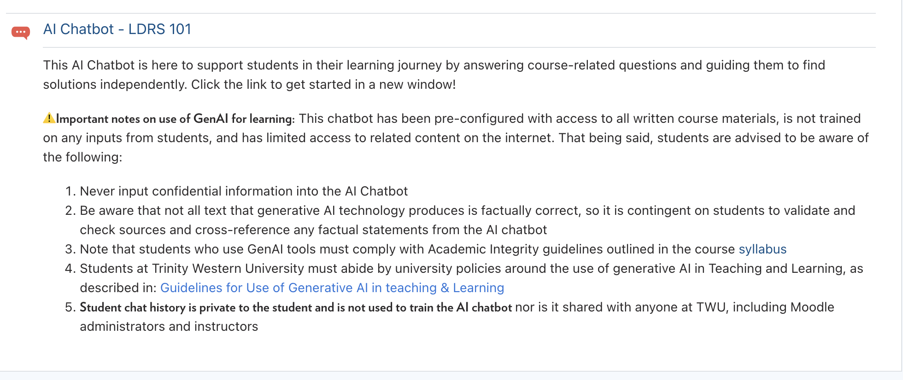
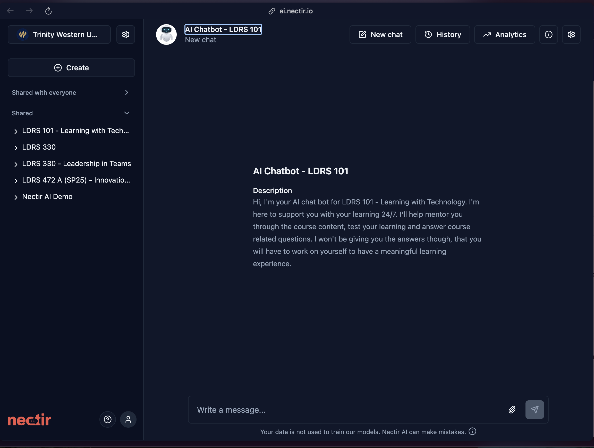
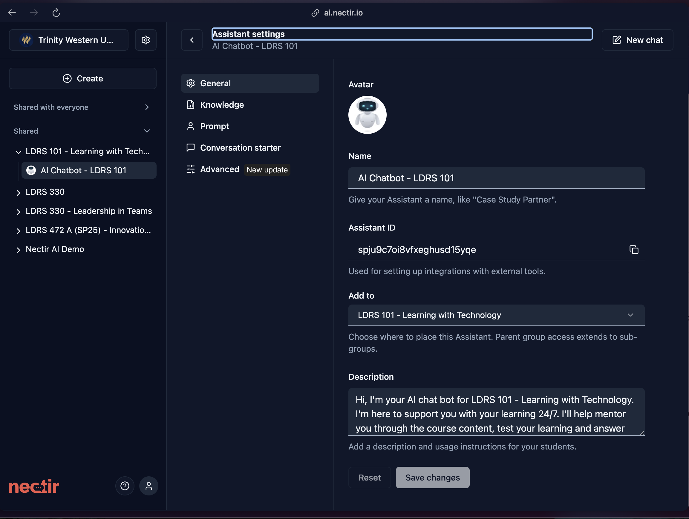
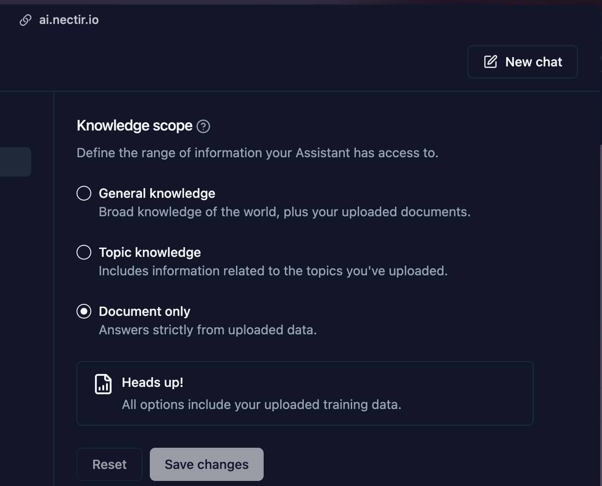
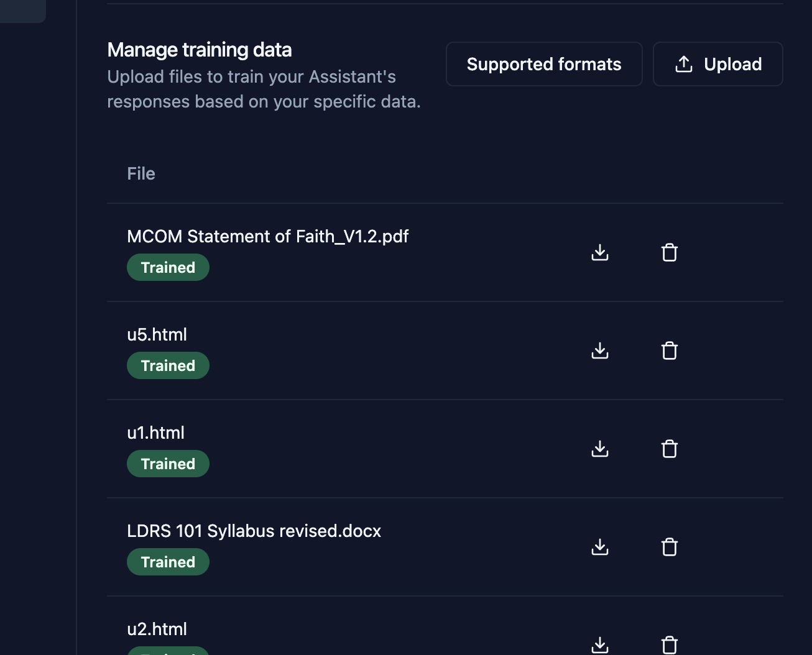
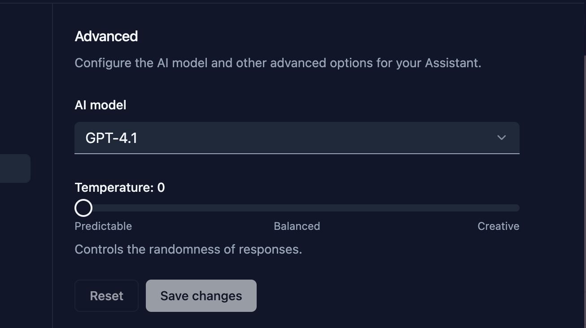

[cmad.land](https://cmad.land)
- slides

---

## nectir.ai 

- pilot implementation in a set of 3 asynchronous courses

---

## Set-up

---

## UX

---

## Settings

---

## Knowledge and Data Settings

::: {.columns}
::: {.column}

:::
::: {.column}
 
:::
:::

# [Prompt](https://cmadland.github.io/slides/posts/prompt)

---

## Advanced Settings

 

 ---

