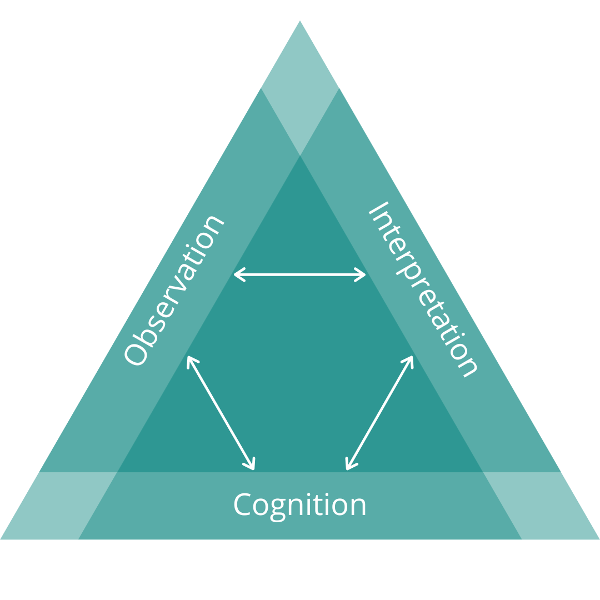
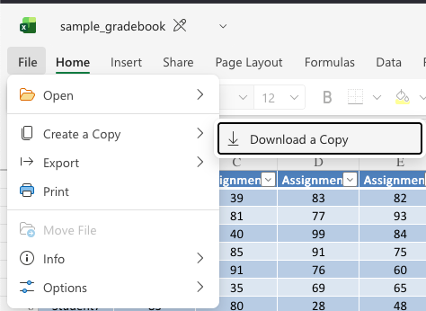
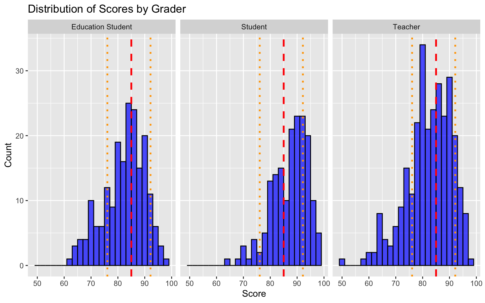
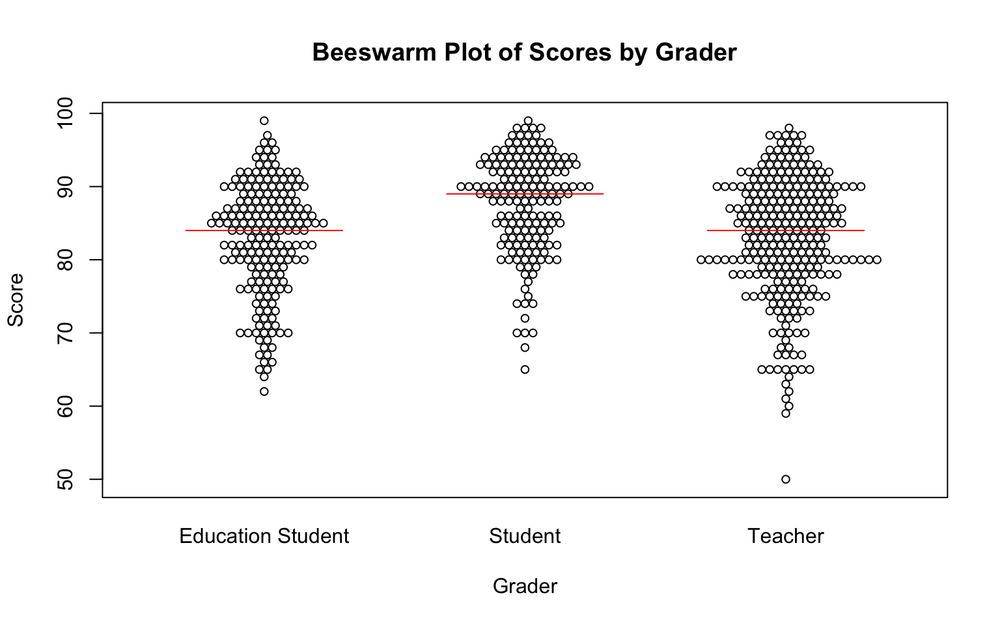
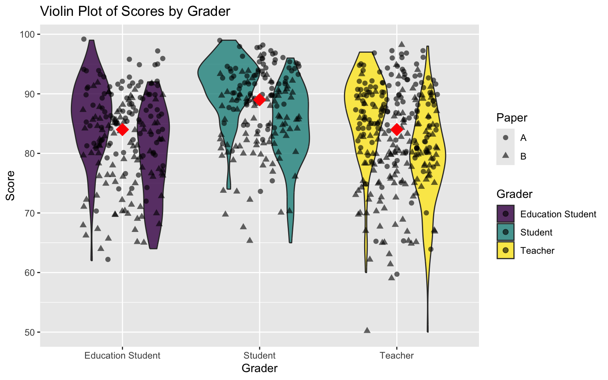

```{r}
#| label: libraries
library(tinytable)
library(tidyverse)
library(knitr)
```

```{r}
#| label: read_csv
df_letters <- read.csv("letter_grades.csv")
df_equiv <- read.csv("pct_grades.csv")
df_types <- read.csv("data-types.csv")
```

# Welcome {background-image="sunrise.jpg"}


# What is Assessment?

---

## Assessment Triangle {background-color="white"}

{fig-align="center" alt="A teal triangle diagram illustrating the assessment triangle. The three sides are labeled Observation, Interpretation, and Cognition in white text. Inside the triangle, three white arrows form a smaller triangle, showing the relationships between the three concepts. The background is plain white, and the tone is neutral and informative."}

::: footer
[@pellegrinoKnowingWhatStudents2001]
:::


---

> A grade is an inadequate report of an inaccurate judgement by a biased and variable judge of the extent to which a student has attained an undefined level of mastery of an unknown proportion of an indefinite material. 

::: footer
[@feldmanGradingEquityWhat2019, p. 25] 
:::
---

## Purposes of Assessment...

...of learning  
...for learning  
...as learning

::: footer
[@earlAssessmentLearningUsing2013]
:::

# learning is ontological

> "The mission of Trinity Western University, as an arm of the Church, is to develop godly Christian leaders: positive, goal-oriented university graduates with thoroughly Christian minds; growing disciples of Jesus Christ who glorify God through fulfilling the Great Commission, serving God and people in the various marketplaces of life."

# teaching is ontological

# assessing is ontological

# Assessment Identity
beliefs | feelings | knowledge | skills

::: footer
[@looneyReconceptualisingRoleTeachers2017]
:::

# Discuss with your group how you would characterize your assessment identity as it is and how it came to be.

---

## Highlights?

::: {.notes}
Poll: Enter 1-3 words at a time that summarize your assessment identity. (WordCloud)
:::

---


---

## Agency in Assessment

::: {.notes}
Poll: What method of reporting assignment grades to learners best fits your current practice?
- percentage scale (e.g., 74%)
- raw score (e.g., 19/26)
- letter grade (e.g., A+, A, A- ... C-, D, F)
- proficiency scale (e.g. Excellent, Meets Expectations, Revision Needed, Not Assessable)
- a combination of the above
- other (please specify)
:::

---

```{r}
#| label: letters
tt(df_letters)

```

---

> The University-wide system of percentage equivalents is shown in the table below [upcoming slide]. *Faculty members may deviate from this scale*; however, if they do so, they must indicate, in their course syllabus, the percentage equivalency system they use. 


# What do you notice? What do you wonder?

---

## Percentage Equivalents {style="text-align: center;"}
<small>

```{r}
#| label: equivalents

equiv_md <- kable(df_equiv, format = "markdown")
equiv_md
```
</small>


---

## Breakout Cooperative Activity 

<span class="badge bg-primary">10 mins</span>

::: {.r-fit-text}


- shared MS Excel file which contains _simulated_ grade data from a class of 100 learners who completed 11 assignments, two papers, one midterm exam, and one final exam.
- all items in the gradebook are recorded as a raw score out of 100
- download the file and open in MS Excel
- using the tools in Excel, decide as a group how you would report these learners' final letter grades
- calculate the grades in the columns to the right of the data
- Use the [TWU Standard Grading System](https://www.twu.ca/about-us/policies-guidelines/student-policies/university-standard-grading-system)


:::


::: {.notes}
https://mytwu-my.sharepoint.com/:x:/g/personal/colin_madland_twu_ca/EWFESCk49hFIvdhXM_YrZlwBUs5ZCTvQIiQZ9olWTNWdVg?e=ed9rWu
:::

---

{fig-align="center" alt="Open File menu in MS Excel online showing the option to 'Create a copy', then the suboption 'Download a Copy'."}

---

## Data Types

```{mermaid}
flowchart TD
A((Data)) --> B(Qualitative - non-numerical)
A --> C(Quantitative - numerical)
B --> D(Nominal)
B --> E(Ordinal)
C --> F(Interval)
C --> G(Ratio)
```

---

| Data Type | Mean | Equidistant | True Zero |
| --- | :---: | :---: | :---: |
| Nominal | ❌ | ❌ | ❌ |
| Ordinal |❌ | ❌ | ❌ |
| Interval |✅ | ✅ | ❌ |
| Ratio | ✅ | ✅ | ✅ |


# GRADE DATA IS ORDINAL!
- averages don't make sense
- no true zero

# Validity and Reliability

---

{fig-align="center" alt="four bulls-eye's with the one on the left showing an array of red dots all missing the target and labeled, 'not valid or reliable'. The second shows an array of dots in the top of outer ring and is labeled 'reliable but not valid'. the third shows an array of dots in the middle ring and is labeled 'both valid and reliable'. the last one has red dots in the centre and green dots around the outside and is labeled 'unfair'."}

---

{fig-align="center" alt="Histogram of data from Starch and Eliott"}

:::{.notes}
https://mytwu-my.sharepoint.com/:u:/g/personal/colin_madland_twu_ca/EdaTKeQImyZJk4o8TNQbBvgBo7G8Bg-PvRDwZhIUGAqwTQ?e=hAglQl
:::

::: footer
[@starchReliabilityGradingHighSchool1912; @starchReliabilityDistributionGrades1913]
:::

---

{fig-align="center" alt="Histogram of data from Starch and Eliott faceted by grader"}

---

{fig-align="center" alt="Beeswarm chart of data from Starch and Eliott"}

---

{fig-align="center" alt="violin plot of data from Starch and Eliott"}

---

## Breakout Conversation
- download 'starch-elliott.zip' and extract to view the images
- discuss in your group to make sense of what you see
- all of the plots are different visualizations of the same data

---

Where to go from here?

# Clearly-defined outcomes

<small>
- 'Learners will be able to...'
  - [verb]
  - [level of proficiency] 
- not 'learners will [verb]' (that's an activity, not an outcome)
- pay attention to the verb
  - remember vs. apply
  - define vs. create
</small>

# Grades communicate progress

- fewer categories of quality (5-13)
- not assessable, emerging, developing, proficient, extending
- not assessable, revision needed, meets expectations, excellent
- 🏗️, ✏️, 👏🏿, 💅🏽, ✨


# Closed feedback loops

## Knowledge of Results

```{mermaid}
flowchart TD
subgraph Assignment 2
    D[Assignment 2 Delivery] -->|Instructor Assessment| E(Knowledge of Results)
    E --> F{fin}
end  
subgraph Assignment 1
    A[Assignment 1 Delivery] -->|Instructor Assessment| B(Knowledge of Results)
    B --> C{fin}
end
  
```

---

## Feedback Loops

```{mermaid}
flowchart TD
A(Learner Work) --> B(Instructor Evaluation)
B --> C(Feedback)
C -->|Learner Sensemaking| A
```


# Reassessment without penalty

::: {.callout-important}
This does NOT mean 'reassessment without limit'!
:::

---

```{mermaid}
flowchart TD
A(Assignment 1 Delivery) --> C(Instructor Assessment of Outcome 1) --> B(Feedback)
B -->|Learner Sensemaking| D(Assignment 2 Delivery)
D --> C
D --> E(Instructor Assessment of Outcome 2)
```

---

> Knowledge emerges only through invention and re-invention, through the restless, impatient, continuing, hopeful inquiry human beings pursue in the world, with the world, and with each other. [@freirePedagogyOppressed1990, p. 72]

---

[cmad.land](https://cmad.land)
- slides

---


# Stop. Be outside. Think.

Recall a time when you were the *object* in an educational transaction, where 'teaching' or 'assessing' was something done **to** you. What might YOU do to avoid commoditizing grades in your practice?

---

## References
