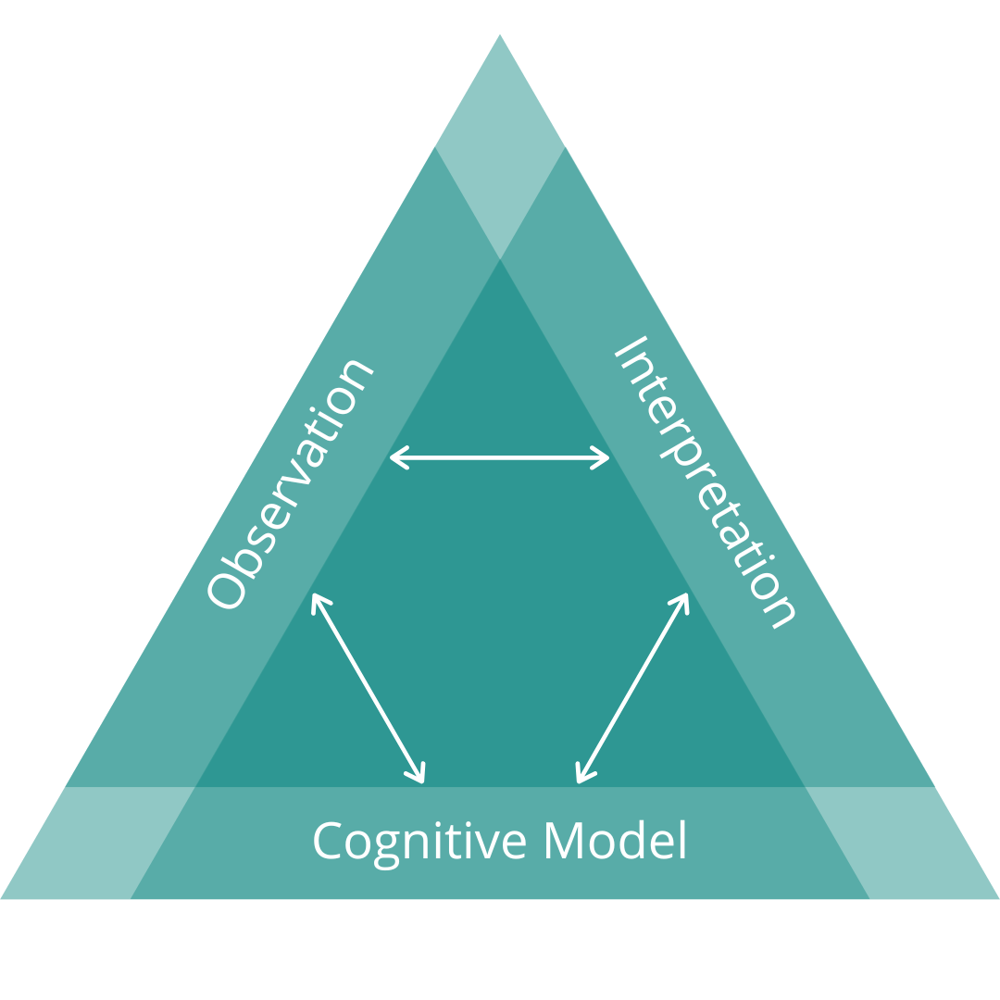
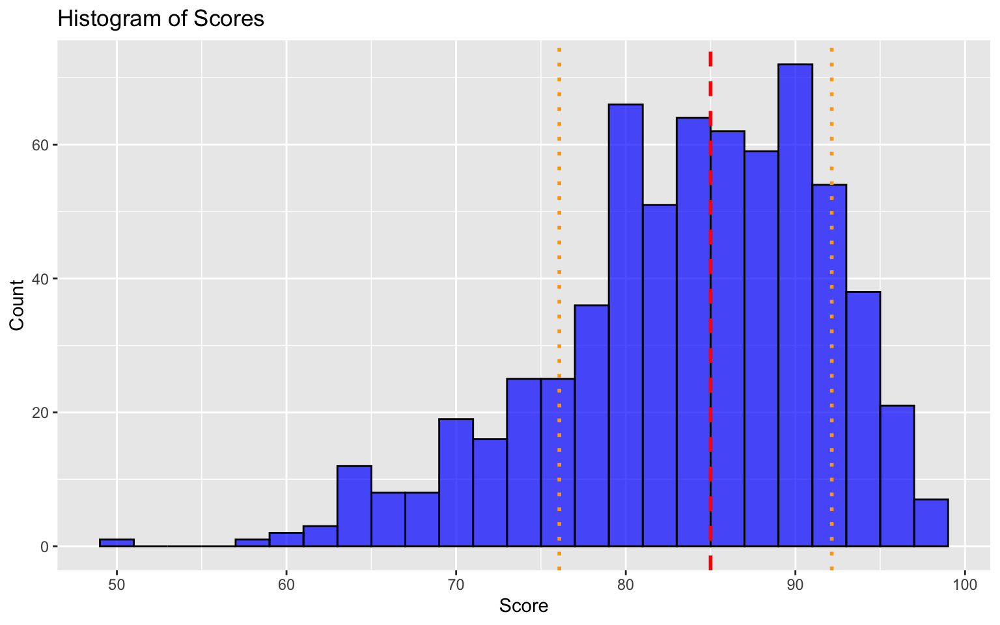
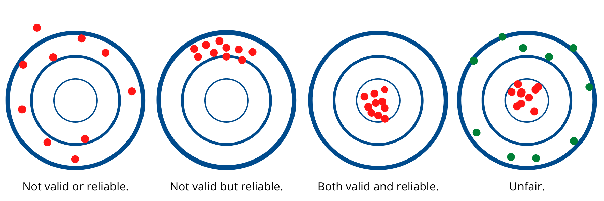

```{r}
#| label: libraries
library(tinytable)
library(tidyverse)
library(knitr)
```

```{r}
#| label: read_csv
df_letters <- read.csv("letter_grades.csv")
df_equiv <- read.csv("pct_grades.csv")
df_types <- read.csv("data-types.csv")
```

# Welcome {background-image="mushbowl.jpg"}


---

## Assessment Triangle {background-color="white"}

{fig-align="center" alt="A teal triangle diagram illustrating the assessment triangle. The three sides are labeled Observation, Interpretation, and Cognition in white text. Inside the triangle, three white arrows form a smaller triangle, showing the relationships between the three concepts. The background is plain white, and the tone is neutral and informative."} 

::: footer
[@pellegrinoKnowingWhatStudents2001]
:::


---


## Purposes of Assessment...

...of learning  
...for learning  
...as learning

::: footer
[@earlAssessmentLearningUsing2013]
:::

---

## Teaching, learning, and assessing are all *ontological*

---

## Assessment Identity
beliefs | feelings | knowledge | skills

::: footer
[@looneyReconceptualisingRoleTeachers2017]
:::


---

## Agency in Assessment

---

## Percentage Equivalents {style="text-align: center;"}
<small>

```{r}
#| label: equivalents

equiv_md <- kable(df_equiv, format = "markdown")
equiv_md
```
</small>


---

## Data Types {background-color="white"}

```{mermaid}
flowchart LR
A((Data)) --> B(Qualitative - non-numerical)
A --> C(Quantitative - numerical)
B --> D(Nominal)
B --> E(Ordinal)
C --> F(Interval)
C --> G(Ratio)
```

---

| Data Type | Mean | Equidistant | True Zero |
| --- | :---: | :---: | :---: |
| Nominal | ❌ | ❌ | ❌ |
| Ordinal |❌ | ❌ | ❌ |
| Interval |✅ | ✅ | ❌ |
| Ratio | ✅ | ✅ | ✅ |

---

## GRADE DATA IS ORDINAL!

- averages don't make sense
- no true zero

---

## Reliability of Grades

---


{fig-align="center" alt="Histogram of data from Starch and Eliott"}


::: footer
[@starchReliabilityGradingHighSchool1912; @starchReliabilityDistributionGrades1913]
:::

---

## AI and Validity of Grades

{fig-align="center" alt="four bulls-eye's with the one on the left showing an array of red dots all missing the target and labeled, 'not valid or reliable'. The second shows an array of dots in the top of outer ring and is labeled 'reliable but not valid'. the third shows an array of dots in the middle ring and is labeled 'both valid and reliable'. the last one has red dots in the centre and green dots around the outside and is labeled 'unfair'."}

---

## Mega Breakouts - an Unconference Experience

- Instructions at the top of the doc

---

> Knowledge emerges only through invention and re-invention, through the restless, impatient, continuing, hopeful inquiry human beings pursue in the world, with the world, and with each other. [@freirePedagogyOppressed1990, p. 72]

---


# Stop. Be outside. Think.


---

[cmad.land](https://cmad.land)
- slides


---

## References
