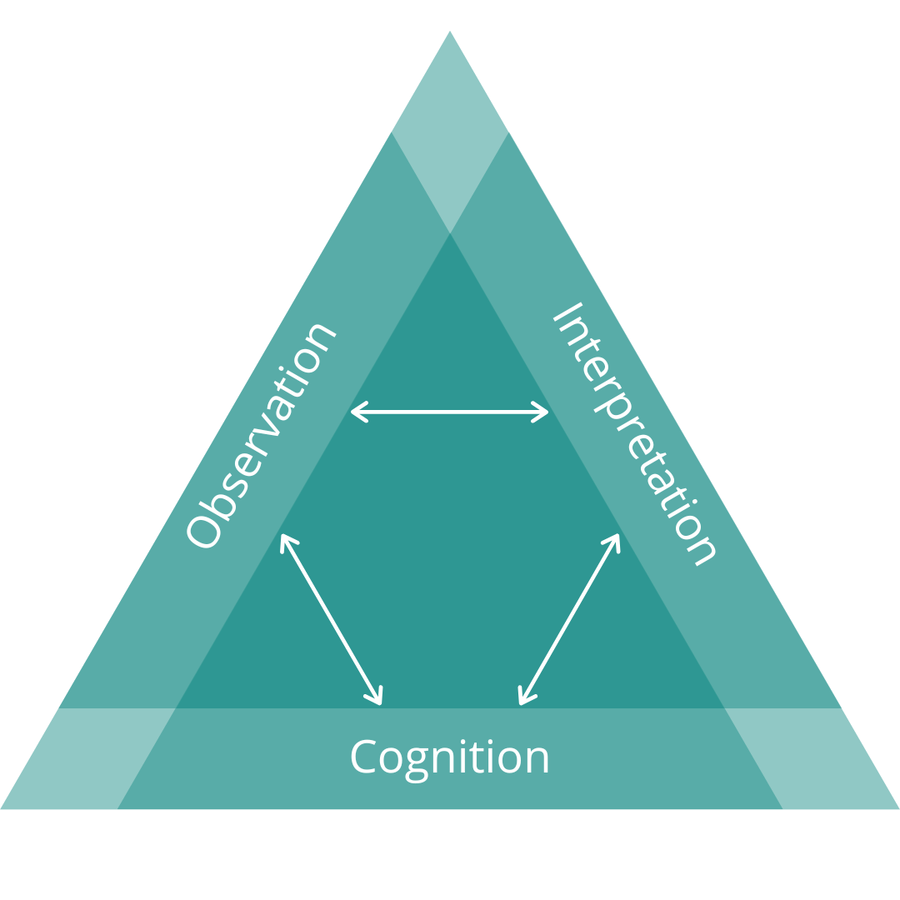
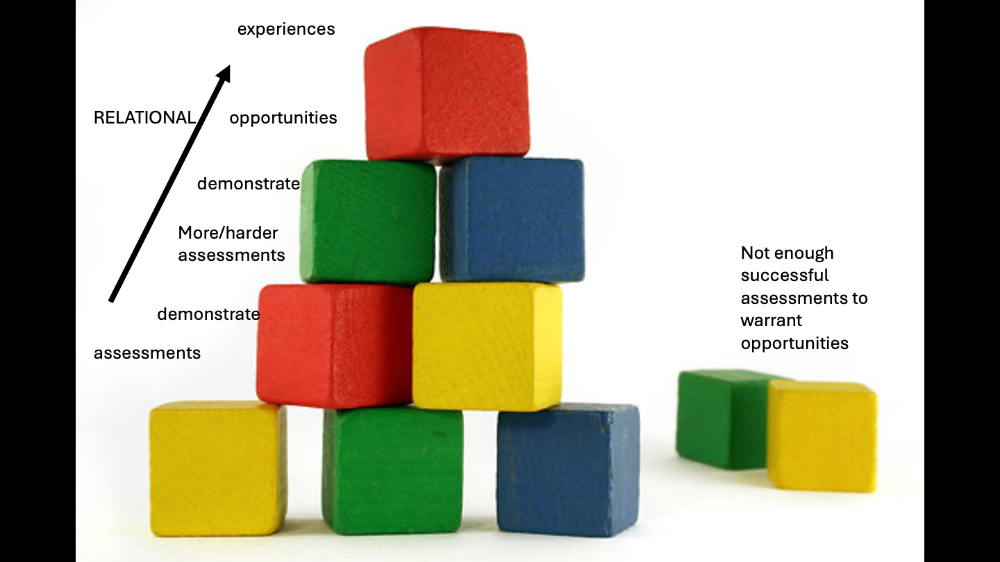

```{r}
library(tidyverse)
library(knitr)
library(ggplot2)
library(dplyr)
library(viridis)
library(ggcorrplot)
library(reshape2)  # For melting the correlation matrix
library(boot)
library(psych)
library(car)  # For the qqPlot function
library(kableExtra)
```


```{r}
# Load the dataset
df_gr <- read.csv("data/pattern.csv")
```

---

## [Folks, we have a problem!](https://cmadland.github.io/starch-elliott)

---

## Theoretical Foundation

---



---

```{mermaid}
%%{init: {'theme':'dark'}}%%
flowchart TD
        A["Technology-Integrated Assessment"]
 subgraph subgraph_2rvu6wpa7["First Order Factors"]
        B("Assessment Purpose")
        C("Duty of Care")
        D("Technology Acceptance")
        E("Assessment Design")
  end
 subgraph subgraph_p3azrijwm["Second Order Factors"]
        F(["Assessment of Learning"])
        G(["Assessment for Learning"])
        H(["Assessment as Learning"])
        I(["Bias"])
        J(["Inclusion"])
        K(["Relationships"])
        L(["Ethical EdTech"])
        M(["Performance Expectancy"])
        N(["Effort Expectancy"])
        O(["Social Influence"])
        P(["Facilitating Conditions"])
        Q(["Measurement Theory"])
        R(["Academic Integrity"])
        S(["Relevance"])
        T(["Reciprocity"])
  end
    A --- B & C & D & E
    B --- F
    F --- G
    G --- H
    C --- I
    I --- J
    J --- K
    K --- L
    D --- M
    M --- N
    N --- O
    O --- P
    E --- Q
    Q --- R
    R --- S
    S --- T
     B:::purpose
     C:::duty
     D:::accept
     E:::design
     F:::purpose
     G:::purpose
     H:::purpose
     I:::duty
     J:::duty
     K:::duty
     L:::duty
     M:::accept
     N:::accept
     O:::accept
     P:::accept
     Q:::design
     R:::design
     S:::design
     T:::design
    classDef purpose fill:#440154,color:#fff,stroke:#440154,stroke-width:4px
    classDef duty fill:#3B528B,color:#fff,stroke:#3B528B,stroke-width:4px
    classDef accept fill:#21918c,color:#fff,stroke:#21918c,stroke-width:4px
    classDef design fill:#5EC962,color:#000,stroke:#5EC962,stroke-width:4px
    style subgraph_2rvu6wpa7 fill:#BBDEFB
    style subgraph_p3azrijwm fill:#C8E6C9
```

---

## Philosophical Foundation

---

## Jess' Story

---


---




---


---

## Who is a Designer?

```{mermaid}
%%{init: {'theme':'dark'}}%%
flowchart LR
A[Do you make decisions?] ---> B((YES!)) ---> C{You're a Designer!}
```

---

## Even teacherswho say they value creativity may actually find creative characteristics undesirable.

---

## What is your tolerance for the FALSE POSITIVE?

---

## Are you more concerned with Billy than you are with the 
FALSE NEGATIVE?

---

## If we cannot have a perfect predictor, what is the error rate that we will tolerate?

---

Who is accountable?  
Who is responsible?  
Where does the buck stop?  
What is YOUR moral responsibility?  
 
---

power asymmetries  
racial dynamics  
mental health considerations  
and other challenges  

---

## When do we apply ethics?

---

## What you measure is what you value

\# of logins  
Time of submission  
“success” / absence of failure  
Completion  
“diversity”  

---

## Who do the rules limit?

- We all are limited by rules  
- No exceptions  
- You must report on your department’s success using these measures  
- Only English speakers can learn from this material  
- Only graduate students can take this course  
- Your thoughts must be organized in a 5 paragraph essay  
- You cannot use Wikipedia as a reference  
 

---


```{r}
# Calculate the mean for each student from columns 2 to 5 in df_gr
student_means <- df_gr %>%
  rowwise() %>%
  mutate(Mean = mean(c_across(2:5), na.rm = TRUE)) %>%
  ungroup() %>%
  select(student, Mean)

kable(student_means, caption = "Mean Grade for Each Learner") %>%
  kableExtra::kable_styling(full_width = TRUE) 

```

---

```{r}
# Show all the data from df_gr in the output
kable(df_gr, caption = "Traditional Gradebook") %>%
  kableExtra::kable_styling(full_width = TRUE)
```


---

## Can we begin a community of practice today?

---

- 
 - Jess example of sisters
  - 1 sister - high achiever; field trip to the art museum - phd in english lit
  - middle sister - loved art; not as good as #1 in academics, was not invited to art museum - went on to get masters at Sorbonne
- when those opportunities are based on grades, inequity is the result

- single point of failure
  - diversify assesment inputs
  - nothing objective about assessment
    - assessment triangle - cognitive model, 

- we all carry a backpack of our dreams, positive and negative experiences, ancestors, descendants - human dynamism
- listen, watch, and create trust - Colin's student with husband in palliative care

- readiness of the indivicual to confront assumptions
- relational - greatest determinant of success - create space for trust
- stickiness - ppl feeling seen and heard - remember something of someone
- self-awareness
- self- to other-centredness 
- ethics all the way down  
- teachers' ability to design and architect the conditions to allow equity to emerge

- do it in community!! 